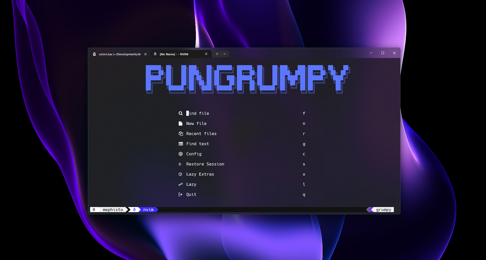
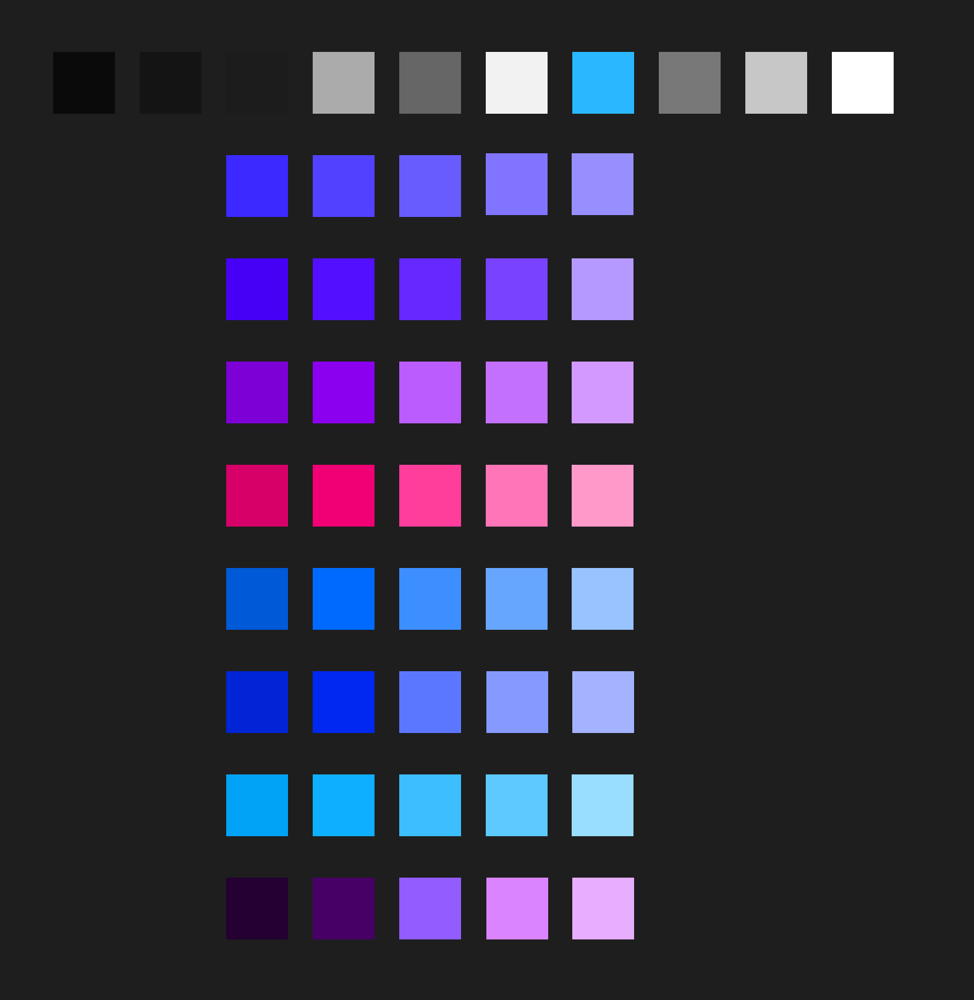
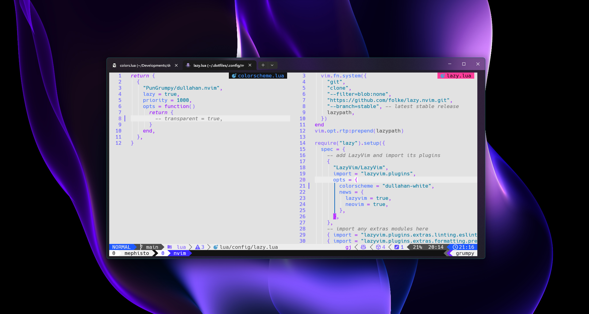
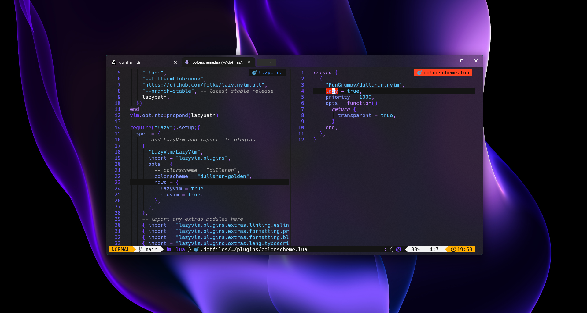

<div align="center">
  
  <h1>Dullahan</h1>
  <p>
    <strong>A dark and light <a href="https://github.com/neovim/neovim">Neovim</a> theme written in <a href="https://www.lua.org">Lua</a></strong> ported from the <a href="https://github.com/PunGrumpy/dullahan-vscode-theme">Visual Studio Code Dullahan</a> theme.
  </p>
  <p>
    <a href="https://gituhb/PunGrumpy/dullahan.nvim/actions/workflows/ci.yml">
      
    </a>
    <a href="https://raw.githubusercontent.com/PunGrumpy/dullahan.nvim/main/LICENSE">
      
    </a>
    <a href="https://raw.githubusercontent.com/PunGrumpy/dullahan.nvim/main/LICENSE">
      
    </a>
  </p>
  
</div>

## `🎨` More Colors

Here is what the improved color palette looks like:



[A Figma Design is available here](https://www.figma.com/file/OJMsaTcWrGtquREeRBIKOi/Dullahan?type=design&node-id=0%3A1&mode=design&t=8LMYDanU2BxszUnh-1)

## `🌈` Styles

### Black


### White



### Golden



## `✨` Features

- Supports the latest [Neovim](https://github.com/neovim/neovim)
  [0.9.0](https://github.com/neovim/neovim/releases/tag/v0.9.0) features.
- Enhances terminal colors.
- Introduces a darker background option for sidebar-like windows.
- Supports all major plugins.
- Provides [Dullahan](https://github.com/PunGrumpy/dullahan.nvim)

## `⚡️` Requirements

- [Neovim](https://github.com/neovim/neovim) >=
  [0.7.2](https://github.com/neovim/neovim/releases/tag/v0.7.2)

## `📦` Installation

Install the theme with your preferred package manager, such as
[folke/lazy.nvim](https://github.com/folke/lazy.nvim):

```lua
{
  "PunGrumpy/dullahan.nvim",
  lazy = false,
  priority = 1000,
  opts = {},
}
```

## `🚀` Usage

### Vim Script

```vim
colorscheme dullahan

" There are also colorschemes for the different styles.
colorscheme dullahan-black
colorscheme dullahan-white
```

### [Lua](https://www.lua.org)

```lua
vim.cmd[[colorscheme dullahan]]
```

#### External Plugins

##### [Barbecue](https://github.com/utilyre/barbecue.nvim)

```lua
-- Lua
require('barbecue').setup {
  -- ... your barbecue config
  theme = 'dullahan',
  -- ... your barbecue config
}
```

##### [Lualine](https://github.com/nvim-lualine/lualine.nvim)

```lua
-- Lua
require('lualine').setup {
  options = {
    -- ... your lualine config
    theme = 'dullahan'
    -- ... your lualine config
  }
}
```

##### [Lightline](https://github.com/itchyny/lightline.vim)

```vim
" Vim Script
let g:lightline = {'colorscheme': 'dullahan'}
```

## `🪓` Overriding Colors & Highlight Groups

How the highlight groups are calculated:

1. `colors` are determined based on your configuration, with the ability to
   override them using `config.on_colors(colors)`.
2. These `colors` are utilized to generate the highlight groups.
3. `config.on_highlights(highlights, colors)` can be used to override highlight
   groups.

For default values of `colors` and `highlights`, please consult the [colors.lua](lua/dullahan/colors.lua) file.

### Settings and color alteration demonstration

```lua
require("dullahan").setup({
  -- use the black style
  style = "black",
  -- disable italic for functions
  styles = {
    functions = {}
  },
  sidebars = { "qf", "vista_kind", "terminal", "packer" },
  -- Change the "hint" color to the "orange" color, and make the "error" color bright red
  on_colors = function(colors)
    colors.hint = colors.orange
    colors.error = "#ff0000"
  end
})
```

### [Borderless Telescope](https://github.com/nvim-telescope/telescope.nvim/wiki/Gallery#borderless) example

```lua
require("dullahan").setup({
  on_highlights = function(hl, c)
    local prompt = "#8599ff" -- hsl(230, 100, 76)
    hl.TelescopeNormal = {
      bg = c.bg_dark,
      fg = c.fg_dark,
    }
    hl.TelescopeBorder = {
      bg = c.bg_dark,
      fg = c.bg_dark,
    }
    hl.TelescopePromptNormal = {
      bg = prompt,
    }
    hl.TelescopePromptBorder = {
      bg = prompt,
      fg = prompt,
    }
    hl.TelescopePromptTitle = {
      bg = prompt,
      fg = prompt,
    }
    hl.TelescopePreviewTitle = {
      bg = c.bg_dark,
      fg = c.bg_dark,
    }
    hl.TelescopeResultsTitle = {
      bg = c.bg_dark,
      fg = c.bg_dark,
    }
  end,
})
```

### Fix `undercurls` in [Tmux](https://github.com/tmux/tmux)

To have undercurls show up and in color, add the following to your
[Tmux](https://github.com/tmux/tmux) configuration file:

```sh
# Undercurl
set -g default-terminal "${TERM}"
set -as terminal-overrides ',*:Smulx=\E[4::%p1%dm'  # undercurl support
set -as terminal-overrides ',*:Setulc=\E[58::2::%p1%{65536}%/%d::%p1%{256}%/%{255}%&%d::%p1%{255}%&%d%;m'  # underscore colours - needs tmux-3.0
```

## `🔥` Contributing

Pull requests are welcome and encouraged. For major changes, please open an
issue first to discuss what you would like to change.

## `📖` Changelog

See the [CHANGELOG.md](CHANGELOG.md) file for details.

## `📝` License

[Affero General Public License v3.0](LICENSE) for more information.

## `🙏` Credits

<table>
  <tr>
    <td align="center">
      <a href="https://github.com/folke">
        
        <br />
        <sub><b>Folke</b></sub>
      </a>
      <br />
      <a href="https://github.com/folke/tokyonight.nvim" title="Tokyo Night" style="text-decoration: none;">🌃</a>
    </td>
    <td align="center">
      <a href="https://github.com/craftzdog">
        
        <br />
        <sub><b>Takuya Matsuyama</b></sub>
      </a>
      <br />
      <a href="https://github.com/craftzdog/solarized-osaka.nvim" title="Solarized Osaka" style="text-decoration: none;">🌅</a>
    </td>
  </tr>
</table>
